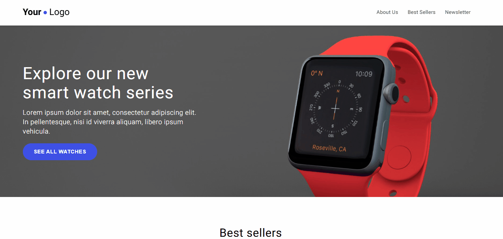

# 🛒🖥 Tech Shop 

## 📝 Descrição do projeto:
Página da web, desenvolvida como um dos exercícios práticos do curso de Web Design Completo do professor Ivan Lourenço Gomes na plataforma da Udemy💜. Esse projeto simula a página inicial de uma loja online de aparelhos tecnológicos e foi feito com o objetivo de praticar a estruturação semântica, organização de estilos, design responsivo e um layout visualmente agradável.

⚠ O conteúdo da página é fictício e serve apenas como apoio visual para demonstrar o comportamento responsivo dos elementos.

## 🚀Tecnologias usadas:
 

## 💡 Funcionalidades:
- Estruturação semântica com HTML;
- Organização e reaproveitamento de estilos CSS
- Design responsivo e organizado;
- Posicionamento de elementos;
- Boas práticas em projetos estáticos.

## 🖼️ Demonstração:

### 📂 Acesso ao projeto:
Você também pode acessar a página online clicando ✨<a href="https://home-tech-shop.vercel.app">aqui</a>✨

## 👩‍💻 Autora:
Feito por ✨[Nathália Anastácio](https://github.com/nath-anastacio)✨
### 💬 Você pode me encontrar em:

  
  

